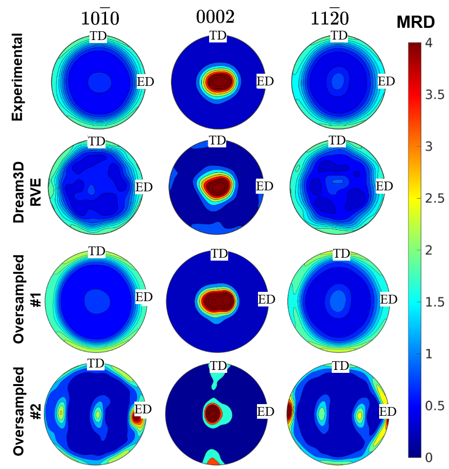

# oversampling_microstructures

This pipeline expands a small set of **measured** textures and grain-size statistics of extruded Mg alloys into a large dataset of DREAM.3D representative volume elements (RVEs). It only interpolates between measurements, so every synthetic state stays in the vicinity of a measured one. For the Acta Materialia paper, 119 measured processing conditions (17 alloy classes) became 105,736 synthetic ODFs and 101,000 RVEs, the training data of the generative model.

<table>
<tr>
<td align="center" width="50%"><br><em>Oversampling. Rows: experimental ODF, the DREAM.3D RVE built from it, and two oversampled ODFs of the same class. Intensity is redistributed within the measured fibre; no new components appear.</em></td>
<td align="center"><br><em>AZ31, downstream use of the RVEs. Rows: DREAM.3D RVE, its orientation-codec round trip, and FM-DiT-512 / FM-DiT-1280 reconstructions.</em></td>
</tr>
</table>

## Pipeline

| Step | Folder | What it does | Tool |
|---|---|---|---|
| 1 | `mtex/` | XRD pole figures → ODF → generalised spherical-harmonic (GSH) coefficients, L = 18 (9,139 complex coefficients) | MATLAB + MTEX |
| 2 | `texture/`, `src/odf_pipeline/` | **Texture oversampling** in the PCA space of the GSH vectors: interpolation, bounded Gaussian sampling and bridges; random-forest, margin and Mahalanobis acceptance filters | Python |
| 3 | `mtex/` | Synthetic GSH → ODF → 100,000 discrete orientations per sample (DREAM.3D angle file) | MATLAB + MTEX |
| 4 | `grain_statistics/` | **Grain-statistics oversampling**: Gaussian copula of ln(grain size) and a Beta aspect ratio, KDE over the five copula parameters, one draw per synthetic texture, grain-count band 250–1000 | Python |
| 5 | `rve_synthesis/` | 300 × 300 × 1 RVEs (2 µm) with DREAM.3D (StatsGenerator, PackPrimaryPhases, MatchCrystallography); optional DAMASK `.vti` export | DREAM.3D 6.5.171 |
| – | `validation/` | Pole-figure validation of the oversampled textures; texture- and grain-coverage plots | MATLAB, Python |

The RVEs are converted into RGB training images with [orientation-codec](https://github.com/mahishguru/orientation-codec) (`orientation-codec batch-global`). See [docs/method.md](docs/method.md) for the method and the paper configuration.

## Installation

```bash
git clone https://github.com/mahishguru/oversampling_microstructures.git
cd oversampling_microstructures
pip install -e ".[damask]"
```

The pipeline needs Python ≥ 3.9; the paper dataset was produced with Python 3.12 ([`requirements-lock.txt`](requirements-lock.txt)). The external tools are:
- MATLAB R2024a with [MTEX 5.11.2](https://mtex-toolbox.github.io) and the Parallel Computing Toolbox, for steps 1 and 3;
- [DREAM.3D 6.5.171](http://dream3d.bluequartz.net), for step 5, with `export DREAM3D_PIPELINE_RUNNER=/path/to/DREAM3D-6.5.171/bin/PipelineRunner`.

## Try it without the measured data

The measured inputs are not distributed with this repository. The demo generator writes synthetic stand-ins with the same format and class structure: 119 conditions in 17 classes. Run everything from the repository root:

```bash
python examples/make_demo_data.py                     # data/odf_harmonics/ + data/stats_copula/
python texture/oversample_textures.py --profile interpolation --experiment-name demo --target-per-class 40
ln -sfn ../experiments/demo/synthetic_samples data/odf_harmonics_sampled
python grain_statistics/02_oversample_copula_params.py
python grain_statistics/03_copula_to_dream3d_stats.py
python grain_statistics/03b_filter_by_grain_count.py
python examples/make_demo_angle_files.py --limit 2    # stands in for the MTEX step 3
python rve_synthesis/04_generate_rves.py --limit-per-material 1
```

The texture step takes about 30 s on the demo data; each RVE takes about 10 s.

## Reproducing the paper dataset

Place the measured data under `data/` as described in [docs/method.md](docs/method.md#data-layout), then run:

```bash
# 1. XRD -> ODF -> GSH (MATLAB with MTEX loaded, working directory = repository root)
>> run('mtex/xrd_to_odf.m'); run('mtex/odf_to_SHcoeffs_batch.m')                # -> data/odf_harmonics/
# 2. texture oversampling (7,500 per class)
python texture/oversample_textures.py --profile interpolation --experiment-name interpolation_v2_target_7500
ln -sfn ../experiments/interpolation_v2_target_7500/synthetic_samples data/odf_harmonics_sampled
# 3. synthetic GSH -> DREAM.3D angle files (MATLAB)
>> run('mtex/SHcoeffs_to_Dream3d_odf_batch_parallel.m')
# 4. grain statistics
python grain_statistics/00_grain_size_stats.py && python grain_statistics/01_extract_copula_params.py
python grain_statistics/02_oversample_copula_params.py && python grain_statistics/03_copula_to_dream3d_stats.py
# 5. RVEs
rve_synthesis/run_pipeline.sh                       # grain-count filter + DREAM.3D + DAMASK export
```

The per-class counts of the paper run are in [`results/interpolation_v2_target_7500/oversampling_report.txt`](results/interpolation_v2_target_7500/oversampling_report.txt).

## Companion repositories

| Repository | Role |
|---|---|
| [orientation-codec](https://github.com/mahishguru/orientation-codec) | RVE orientation field ↔ RGB image |
| [microstructure-encoder-decoder](https://github.com/mahishguru/microstructure-encoder-decoder) | generative encoder–decoder trained on these RVEs |
| [meridian](https://github.com/mahishguru/meridian) | inverse design in the learned latent space against a DAMASK oracle |

## License

MIT, see [LICENSE](LICENSE). Developed at the Institute of Material and Process Design, Helmholtz-Zentrum Hereon.
