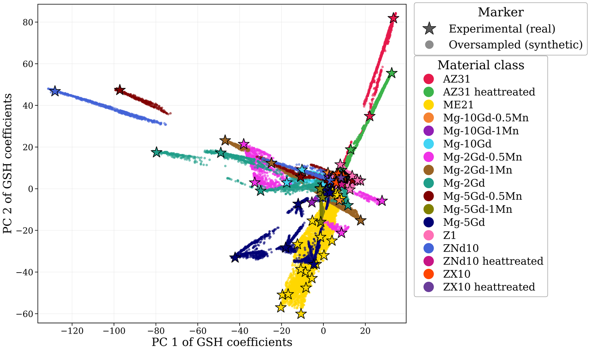
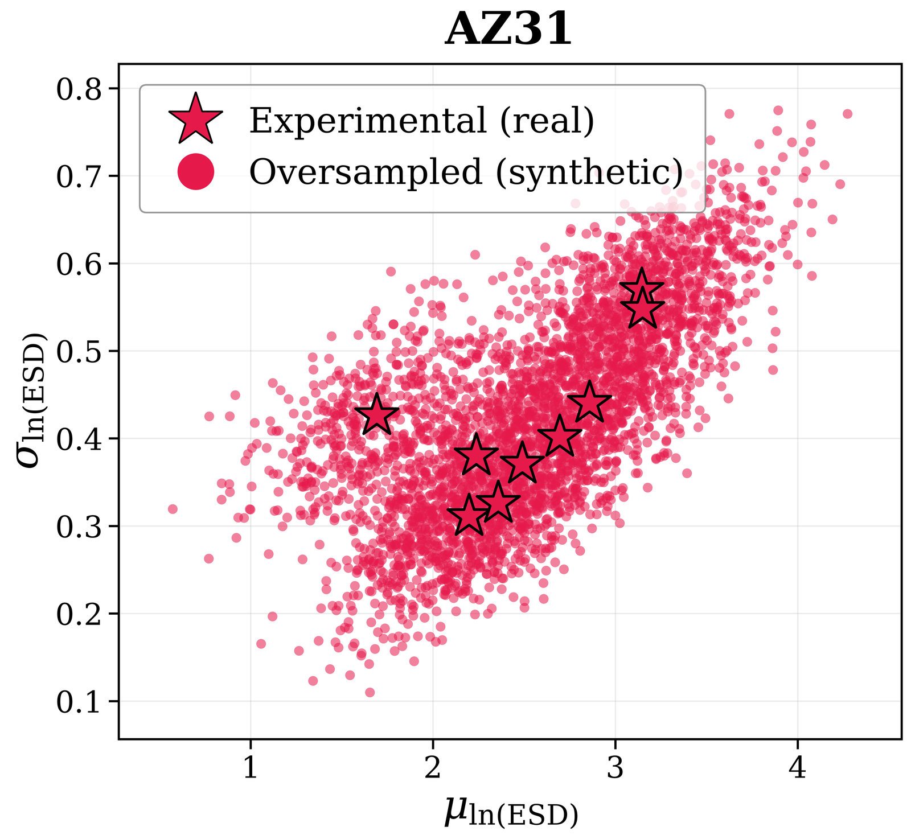

# Method and paper configuration

## Data layout

All scripts are run from the repository root and read or write `data/`:

```
data/
├── measured/<Alloy>_extruded/<T>_<v>/        measured conditions (not distributed)
│   ├── XRD/PF_{100,002,101,102,110,103}.xrdml (+ UG_*.xrdml background)   -> odf.txt (step 1)
│   └── OM/temp/temp_binary/*_mask_statistics.csv    per-grain Width, Height, Area (optical micrographs)
├── odf_harmonics/                             measured GSH coefficients, one file per condition (step 1)
├── stats/, stats_aspect_beta/                 measured grain-size statistics (grain_statistics/00)
├── stats_copula/                              measured copula parameters, one file per condition (01)
├── odf_harmonics_sampled/<class>/             synthetic GSH coefficients (link to experiments/<run>/synthetic_samples)
│   └── dream3d_angles_uniform/                100,000-orientation DREAM.3D angle files (step 3)
├── stats_copula_sampled/<class>/              one copula draw per synthetic texture (02)
├── stats_combined_sampled/<class>/            DREAM.3D grain-size / aspect-ratio tables (03, 03b)
├── rve/<class>/<i>/                           RVEs: .dream3d, .xdmf, .vti (step 5)
└── validation_<alloy>/                        inputs and outputs of the pole-figure validation
```

A GSH coefficient file holds 9,139 lines `real imag`: the coefficients of the MTEX `SO3FunHarmonic` of the ODF at bandwidth L = 18. Files are named `<Alloy>_extruded[_heattreated]_<T>_<v>_odf_harmonics.txt`, and the class is the name without the last two tokens (extrusion temperature and ram speed).

## 1. Measured textures (`mtex/xrd_to_odf.m`, `mtex/odf_to_SHcoeffs_batch.m`)

- **Pole figures to ODF:** the six measured XRD pole figures of each condition are background-corrected and inverted to an ODF with `calcODF` (5° resolution, ghost correction). The ODF is then rotated by 90° about z into the sample frame used throughout.
- **Symmetry:** crystal symmetry 6/mmm (a = 3.2093 Å, c = 5.2103 Å, X ∥ a\*), triclinic specimen symmetry, Bunge Euler angles.
- **ODF to GSH:** each ODF is expanded as `SO3FunHarmonic` with bandwidth 18, giving 9,139 complex coefficients.

## 2. Texture oversampling (`texture/oversample_textures.py`, `src/odf_pipeline/`)

The paper run is `python texture/oversample_textures.py --profile interpolation --experiment-name interpolation_v2_target_7500`, with a random seed of 42. The `interpolation` profile sets:

| Stage | Implementation | Setting (profile `interpolation`) |
|---|---|---|
| Latent space | `PCATransformer`: StandardScaler + PCA of the 18,278-D (real, imaginary) vectors of all measured conditions | 110 components, retaining 99.96 % of the variance of the 119 measured vectors |
| Class structure | `ClassStatistics`: K-means sub-centroids per class, Ledoit–Wolf covariance | k = min(3, n/3) sub-clusters for classes with n ≥ 6 conditions |
| Augmentation halo | `Augmentor`: anisotropic Monte-Carlo jitter, amplitude scaling, local mix-up, smooth per-component scaling | jitter 3× (σ = 0.010), 1× each of the others |
| Boundary samples | `HybridSampler`: ADASYN (SMOTE fallback) on measured + halo points | 30 % of the candidates |
| Interior fill | Dirichlet barycentric combinations of up to 4 points (α = 1) and per-sub-cluster Gaussian samples (Ledoit–Wolf covariance, scale 1.25), on measured + halo points | 50 / 50 |
| Bridges | Dirichlet mixtures across sub-clusters of multi-modal classes | 25 % of the interior pool |
| Contextual adjustment | small shift of each candidate towards the nearest other-class centroid | α = 0.03 |
| Candidates | per class | 2 × target |
| Filter 1 | random-forest class probability (200 trees, trained on measured + halo points) | ≥ 0.60 |
| Filter 2 | geometric margin: distance to nearest other-class sample / distance to own class | ≥ 1.05 |
| Filter 3 | Mahalanobis distance to the nearest sub-centroid | ≤ 1.3 × 99th percentile of the measured distances |
| Cap and floor | keep the lowest-Mahalanobis candidates up to the target; guarantee a minimum per class | target 7,500, floor 750 |
| Output | inverse PCA → one GSH coefficient file per synthetic sample | `experiments/<run>/synthetic_samples/<class>/<class>_<i>.txt` |

The paper run produced 105,736 synthetic ODFs from 119 measured conditions. The per-class counts are in [`results/interpolation_v2_target_7500/oversampling_report.txt`](../results/interpolation_v2_target_7500/oversampling_report.txt). The two heat-treated classes with only two measured conditions (ZNd10, ZX10) stay at the 750 floor and are not used for the RVE dataset.

<p align="center"></p>
<p align="center"><em>Measured (stars) and oversampled (dots) textures in the first two principal components of the GSH space, for all classes. Made by validation/texture_coverage_figures.py.</em></p>

`texture/verify_results.py` counts the outputs of a run, and `texture/replot_highquality.py` re-renders the pipeline diagnostics at publication resolution.

## 3. Angle files (`mtex/SHcoeffs_to_Dream3d_odf_batch_parallel.m`)

Each synthetic GSH file is reconstructed as an MTEX ODF, and 100,000 orientations are drawn from it with `discreteSample`. They are written as a DREAM.3D StatsGenerator angle file with rows `phi1 Phi phi2 weight sigma` (degrees; weight 1, σ = 1). The script runs 8 parallel workers with a per-file seed. `SHcoeffs_to_odf_batch_parallel.m` writes the reconstructed ODFs themselves (`_ODF.txt`) for inspection.

## 4. Grain statistics (`grain_statistics/`)

| Script | Step |
|---|---|
| `00_grain_size_stats.py` | moments of the measured grain-size and aspect-ratio distributions per condition (the "experimental" points in the coverage plots) |
| `01_extract_copula_params.py` | per condition: equivalent-circle diameter d = 2√(A/π) and aspect ratio AR = min(W, H)/max(W, H) of every segmented grain; ln d ~ N(μ, σ), AR ~ Beta(α, β), Gaussian-copula correlation ρ of the normal scores → (μ, σ, α, β, ρ) |
| `02_oversample_copula_params.py` | per class: 5-D Gaussian KDE (Scott bandwidth) of the measured (μ, σ, α, β, ρ), or a regularised multivariate normal when a class has fewer than 6 distinct conditions. Rejection sampling keeps σ > 0, α, β > 0, ρ ∈ [−1, 1] and a predicted grain count in [250, 1000]. Exactly one draw is made per synthetic texture. |
| `03_copula_to_dream3d_stats.py` | 100,000 grains drawn from each copula, binned in 1 µm diameter bins over μ ± 3σ, with a per-bin Beta fit of the aspect ratio (empty bins filled from a KDE) → DREAM.3D grain-size (`_stats.txt`) and aspect-ratio (`_stats_aspect_beta.txt`) tables |
| `03b_filter_by_grain_count.py` | removes samples whose predicted grain count lies outside [250, 1000] |
| `calibrate_grain_count.py` | compares the predicted with the realised DREAM.3D grain counts |

The predicted grain count of a 300 × 300 × 1 RVE at 2 µm (V = 7.2 × 10⁵ µm³) is N = V / ((π/6) · exp(3μ + 4.5σ²)). The band 250 ≤ N ≤ 1000 is equivalent to 7.23 ≤ 3μ + 4.5σ² ≤ 8.61.

<p align="center"></p>
<p align="center"><em>AZ31: measured (stars) and oversampled (dots) (μ, σ) of ln(ESD). Made by validation/grain_coverage_figures.py.</em></p>

## 5. RVE synthesis (`rve_synthesis/`)

`04_generate_rves.py` pairs each synthetic texture with its grain statistics by sample index. It then fills a copy of `template.json`, a DREAM.3D 6.5.171 pipeline, and runs `PipelineRunner`. The pipeline's filters are:
- **StatsGenerator:** hexagonal phase; the grain-size, B/A and ODF tables come from the files above.
- **InitializeSyntheticVolume:** 300 × 300 × 1 voxels at 2 µm.
- **EstablishShapeTypes.**
- **PackPrimaryPhases:** periodic boundaries.
- **FindNeighbors.**
- **MatchCrystallography:** 5 × 10⁵ iterations.
- **GenerateIPFColors.**
- **DataContainerWriter.**

With `damask` installed, each RVE is also exported as a DAMASK geometry (`.vti`). `run_pipeline.sh` runs the grain-count filter and the RVE generation in sequence. To turn RVEs into training images, encode them with the class means that the released generative models were trained with (`data/class_means.json` of [orientation-codec](https://github.com/mahishguru/orientation-codec)):

```bash
orientation-codec batch-global data/rve /path/to/orientation-codec/data/class_means.json -o data/png --fmt png
```

For new alloy classes, compute class means first with `orientation-codec compute-means data/rve -o class_means.json`.

## Validation figures (`validation/`)

| Paper figure | Script |
|---|---|
| Texture coverage in PCA space (per class, all classes) | `texture_coverage_figures.py --experiment <run> [--highlight <class> ...]` |
| Grain-statistics coverage (μ, σ of ln ESD) | `grain_coverage_figures.py [--highlight <class> ...]` |
| Pole figures: input ODF, DREAM.3D RVE, oversampled ODFs | `extract_rve_euler.py <folder>` (RVE voxel orientations), then `pf_publication_AZ31_validation.m` / `pf_publication_Mg5Gd_validation.m` in MATLAB (MTEX, 10° half-width, 0–4 MRD) |
